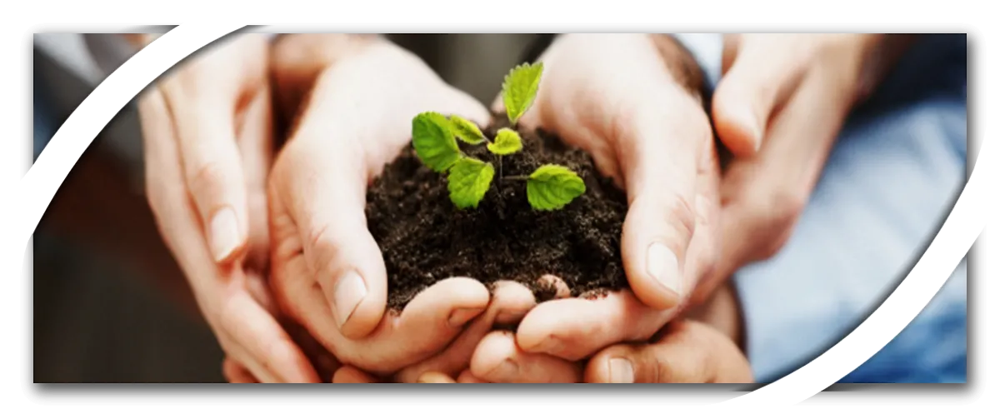

<!-- armirage .github CODE_OF_CONDUCT.md -->
[:earth_americas: :speech_balloon: English](./l10n/code-of-conduct/index.md)\
[Table of Contents](#table-of-contents)

<!-- Armirage OS Header -->

	

<!-- Banner -->

	
	

		<small>"Business growth - Hands holding green plant indicating teamwork stock photo" by yuri, licensed under iStock</small>
		
			<a href="#banner-note">[1]</a>
		
	

&nbsp;
<!-- Content -->
<h1>Code of Conduct</h1>

> When a group of disparate individuals come together, there will be disagreement. There will be people who dislike each other. There will be a difference of opinions, strategies, backgrounds, skill level, etc. And **that** is a *beautiful* thing. Strength is not only in numbers, but also diversity.

<!-- omit in toc -->
## Table of Contents
- [Our Pledge](#our-pledge)
- [Our Standards](#our-standards)
- [Our Responsibilities](#our-responsibilities)
- [Scope](#scope)
- [Enforcement](#enforcement)
- [Acknowledgments](#acknowledgments)
- [How to Contribute](#how-to-contribute)
- [Contact](#contact)
- [Footnotes](#footnotes)

## Our Pledge

In the interest of fostering an open and welcoming environment, we as contributors and maintainers pledge to making participation in our project and our community a harassment-free experience for everyone, regardless of age, body size, disability, ethnicity, gender identity and expression, level of experience, education, socio-economic status, nationality, personal appearance, race, religion, or sexual identity and orientation.

## Our Standards

Examples of behavior that contributes to creating a positive environment include:

* Using welcoming and inclusive language
* Being respectful of differing viewpoints and experiences
* Gracefully accepting constructive criticism
* Focusing on what is best for the community
* Showing empathy towards other community members

Examples of unacceptable behavior by participants include:

* The use of sexualized language or imagery and unwelcome sexual attention or
  advances
* Trolling, insulting/derogatory comments, and personal or political attacks
* Public or private harassment
* Publishing others' private information, such as a physical or electronic
  address, without explicit permission
* Other conduct which could reasonably be considered inappropriate in a
  professional setting

## Our Responsibilities

Project maintainers are responsible for clarifying the standards of acceptable behavior and are expected to take appropriate and fair corrective action in response to any instances of unacceptable behavior.

Project maintainers have the right and responsibility to remove, edit, or reject comments, commits, code, wiki edits, issues, and other contributions that are not aligned to this Code of Conduct, or to ban temporarily or permanently any contributor for other behaviors that they deem inappropriate, threatening, offensive, or harmful.

## Scope

This Code of Conduct applies both within project spaces and in public spaces when an individual is representing the project or its community. Examples of representing a project or community include using an official project e-mail address, posting via an official social media account, or acting as an appointed representative at an online or offline event. Representation of a project may be further defined and clarified by project maintainers.

## Enforcement

Instances of abusive, harassing, or otherwise unacceptable behavior may be reported by contacting the Armirage representative: <a href="mailto:ava@armirage.com">Ava@armirage.com</a>. All complaints will be reviewed and investigated and will result in a response that is deemed necessary and appropriate to the circumstances.

The Armirage OSS team is obligated to maintain confidentiality with regard to the reporter of an incident. Further details of specific enforcement policies may be posted separately.

Project maintainers who do not follow or enforce the Code of Conduct in good faith may face temporary or permanent repercussions as determined by other members of the project's leadership.

## Acknowledgments

This Code of Conduct is adapted from the Contributor Covenant[2](#covenant-note)

## How to Contribute

Review the [Contributing Guidelines](https://github.com/armirage/.github/blob/master/CONTRIBUTING.md) for ways to make this repository better.

Open Source Software (OSS) is only as strong as our Community.

## Contact

Armirage Github repositories and @armirage scoped NPM modules are maintained by [Armirage](https://www.armirage.com), A Technology Solutions company, feel free to <a href="mailto:helloyall@armirage.com">contact us</a>!

## Footnotes

<!-- The return ↩ link will return the reader to the footnote anchor -->
<b id="banner-note">[1]:</b> ["Business growth - Hands holding green plant indicating teamwork stock photo"](https://www.istockphoto.com/photo/business-development-hands-holding-seedling-in-a-group-gm121198600-12181084) by [yuri](https://www.istockphoto.com/portfolio/yuri), licensed under [iStock](https://www.istockphoto.com/legal/license-agreement) [:arrow_heading_up:](#anchor-1)

<b id="covenant-note">[2]:</b> Contributor Covenant Code of Conduct <https://www.contributor-covenant.org/version/1/4/code-of-conduct.html> [accessed 27 September 2020] [:arrow_heading_up:](#anchor-2)

&nbsp;

&nbsp;

  
Armirage logos Copyright © 2020, Clinton Mulligan. All rights reserved.

