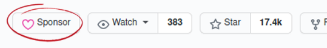

<!-- armirage .github CONTRIBUTING.md -->
[:earth_americas: :speech_balloon: English](./l10n/contributing/index.md)\
[Table of Contents](#table-of-contents)

<!-- Armirage OSS Header -->

	

<!-- Banner -->

	
	

			<small>"Brainstorming Cog Collaboration Team Togetherness Concept" by rawpixel, licensed under 123RF Standard</small>
		
			<a href="#banner-note">[1]</a>
		
	

&nbsp;
<!-- Content -->
<h1>Contributing Guidelines</h1>

> Open Source Software is for the people by the people. As maintainers, Armirage arbitrates differing views and guides the overall direction of development under the `armirage` namespace. None of that is possible without YOU. :heart:

<!-- omit in toc -->
## Table of Contents
- [Ways to Support a Project](#ways-to-support-a-project)
- [Sponsor a Project](#sponsor-a-project)
- [Submit Images](#submit-images)
- [Create a Pull Request](#create-a-pull-request)
	- [Basic Process](#basic-process)
	- [Coding Guidelines](#coding-guidelines)
- [Acknowledgements](#acknowledgements)
- [Contact](#contact)
- [Footnotes](#footnotes)

## Ways to Support a Project

For projects to be successful we need **ALL KINDS** of people.

Before contributing code or documentation, ask the maintainers if a similar effort is already in progress. We want your time and effort to be worth it.

If you are unsure how to assist the development and growth of a project, ask the maintainers of the repo.

| Ways you can support a project ...              | How it helps the developer ...                   | Topic                                         |
| ----------------------------------------------- | ------------------------------------------------ | --------------------------------------------- |
| *Use the software and ask questions.*           | We all learn.                                    | See [Support Resources](./SUPPORT.md)         |
| *Use the software and report bugs.*             | We fix the code, making it more robust.          | See [Support Resources](./SUPPORT.md)         |
| *Donate funds to a project.*                    | We can buy pizza, coffee, and keep the power on. | [Sponsor a Project](#sponsor-a-project)       |
| *Donate artwork, GUI elements, or screenshots.* | Please... make us look cool.                     | [Submit Images](#submit-images)               |
| *Translate the documentation.*                  | We can reach more people around the world.       | [Create a Pull Request](#make-a-pull-request) |
| *Contribute code.*                              | A helping hand is always greatly appreciated.    | [Create a Pull Request](#make-a-pull-request) |
| *Report a security vulnerability*               | We all benefit from the added protection.        | See [Security Policy](./SECURITY.md)          |
&nbsp;

## Sponsor a Project

One of the easiest, yet most powerful ways to contribute is with money. It encourages the developer to keep the project alive, focus their attention on projects people rely on, fix bugs, and add features being asked for.

A "Sponsor" button is located at top of the repository's page. Usually in front of the "Watch", "Star", and "Fork" badges.

- [ ] Click on the "Sponsor" button.
- [ ] Choose the donation method you feel most secure with.
- [ ] Follow that method's steps to contribute funds.

A list of donation methods are also available in the side bar under "Sponsor this Project". Thankyou.

## Submit Images

A picture is worth a thousand words. From screen grabs in the README to buttons in a GUI, images are an important part of any project. A programmer may struggle being Artist, Writer, Editor, Social Media influencer, YouTube Intro Animator, and Coder for a project. *(sarcasm)*

Before starting work, reach out to the repository's team by [posing a question](./SUPPORT.md) in the `Issues` forum. A project could have an unique implementation of the image is rendered. This will also get an Issue number to reference for subsequent [pull requests](#create-a-pull-request).

Images should be zipped and sent to the lead maintainer at <a href="mailto:devops@armirage.com?subject=Images REPO-NAME-HERE">devops@armirage.com</a> for sanitation. This merely a security check for stripping out metadata and scanning for viruses. If you desire, some metadata such as Author can be kept in.

When the pictures are approved for inclusion, the devops team will work with you to implement the images, alter current attributions, update documentation, update code, and perform a pull request so you can get the credit you deserve. Thankyou.

## Create a Pull Request

There are great tutorials on how to perform a pull request on GitHub. Here is just a small selection:

* [Github Guides Hello World](https://guides.github.com/activities/hello-world)
  * GitHub's own practice repository, no fears of breaking anything.
* [First Contributions](https://github.com/firstcontributions/first-contributions)
  * Many pictures, and a live repo to test out the process.
* [Thinkful GitHub Pull Request Tutorial](https://www.thinkful.com/learn/github-pull-request-tutorial)
  * Very informative. Touching on nuances such as making a good commit message.
* [Creating Your First Pull Request in GitHub](https://scotch.io/tutorials/creating-your-first-pull-request-in-github)
  * Kapehe has a course write up and an accompanied YouTube video on using the terminal with `git` commands. I recommend it if you prefer a human face. 
* [Lesson 2. How To Create A Pull Request on Github: Propose Changes to GitHub Repositories](https://www.earthdatascience.org/courses/intro-to-earth-data-science/git-github/github-collaboration/how-to-submit-pull-requests-on-github/)
  * An online book geared towards academics using GitHub collaboratively. Covers more than just Pull Requests.

### Basic Process

With `Issues` we can collect end agent feedback, report software bugs, and organize tasks we want to accomplish. The `Issues` forum is more than just a place to report software bugs. All pull requests must be associated with an Issue for tracking purposes.

- [ ] Search `Issues` for the related issue your Pull Request (PR) solves.
- [ ] If none are found, create an issue using one of the provided templates.
  * :memo: Make a note of the issue number, it will be asked for during the PR.
- [ ] Copy the repo to your GitHub account. Do this by Forking it. The name will change from armirage/repo-name to -your-name-/repo-name.
  * :memo: We use the **develop** branch to stage all new features, bug fixes, etc. remember to create the PR against **develop** as your upstream.
- [ ] Create a new branch off of your Fork. Name it GitHub Account name plus 3-5 words to describe what your commit does. (e.g. githubName_update_contributing_docs)
- [ ] Copy the repo to your local machine to be worked on. Clone or Download your GitHub Fork to your local machine.
- [ ] Make code changes.
- [ ] Ensure unit tests pass and abide by the [Coding Guidelines](#coding-guidelines).
- [ ] Create a pull request against **develop** branch.
  
A repo maintainer will be notified of the request and review the changes. They may communicate more with you for some minor revisions or constructive criticism. Once approved you PR will be merged with the **develop** branch and eventually merged into the master for the next release.

Armirage is working on a few projects and documentation to make this process easier.

### Coding Guidelines

We strive for consistent quality and feel to the code. More documentation and tooling will be forth coming to assist in this effort.

For now use [@armirage/eslint-config-armirage](https://www.npmjs.com/package/@armirage/eslint-config-armirage) to match Armirage code style.

## Acknowledgements

GitHub, First Contributions, Thinkful (Jeff Escalante), Scotch.io (Kapehe), and Earth Data Sciences for their efforts and tutorials!  

## Contact

Armirage Github repositories and @armirage scoped NPM modules are maintained by [Armirage](https://www.armirage.com), A Technology Solutions company, feel free to <a href="mailto:helloyall@armirage.com">contact us</a>!

## Footnotes

<b id="banner-note">[1]:</b> ["Brainstorming Cog Collaboration Team Togetherness Concept"](https://www.123rf.com/photo_41875793_brainstorming-cog-collaboration-team-togetherness-concept.html?downloaded=1) by [rawpixel](https://www.123rf.com/profile_rawpixel), licensed under [123RF Standard](https://www.123rf.com/license.php?type=standard) [:arrow_heading_up:](#anchor-1)

&nbsp;

&nbsp;

  
Armirage logos Copyright © 2020, Clinton Mulligan. All rights reserved.

