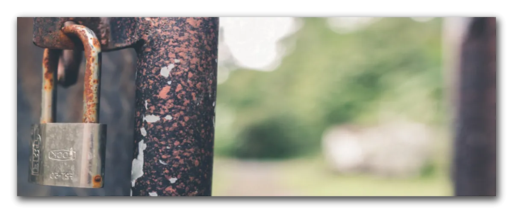

<!-- armirage .github SECURITY.md -->
[:earth_americas: :speech_balloon: English](./l10n/security/index.md)\
[Table of Contents](#table-of-contents)

<!-- Armirage OSS Header -->

	

<!-- Banner -->

		
	

		<small>"Rusted Grey Padlock in Selective-focus Photography" by Artem Beliaikin, licensed under Pexel.</small>
		
			<a href="#banner-note">[1]</a>
		
	

<!-- Subheader: Project Name and Links -->
&nbsp;
<h1>Security Policy</h1>

<!-- Excerpt -->
> Cyber security is challenging field. It requires people with unique talents, knowledge and tools to be effective. While good habits is everyone's responsibility, exposing weaknesses in an implementation is likely to be more difficult. We appreciate the efforts of everyone to ensure each others safety.

<!-- omit in toc -->
## Table of Contents
- [Reporting a Vulnerability](#reporting-a-vulnerability)
- [Disclosure Policy](#disclosure-policy)
- [How to Contribute](#how-to-contribute)
- [Acknowledgements](#acknowledgements)
- [Contact](#contact)
- [Footnotes](#footnotes)

## Reporting a Vulnerability

If you think you have identified a security related issue with a repository, please report it immediately to the lead maintainer at <a href="mailto:devops@armirage.com?subject=SECURITY REPO-NAME-HERE">devops@armirage.com</a>. If you are not sure, don’t worry. Better safe than sorry – just send an email.

Do not open issues related to any security concerns publicly. Please do not include anyone else on the disclosure email. Preferably only one point of contact for replies.

When reporting an issue, include as much information as possible. Just tell us what you found, how to reproduce it, and any concerns you have about it. We will respond as soon as possible and follow up with any missing information.

## Disclosure Policy

Once an issue has been confirmed, we will work to resolve it.

If you have a suggestion for a patch; Coordinate with the lead maintainer for when to publicly post an issue and pull request. Giving you credit for your effort. Thankyou.

## How to Contribute

Review the [Contributing Guidelines](https://github.com/armirage/.github/blob/master/CONTRIBUTING.md) for ways to make this repository better.

Open Source Software (OSS) is only as strong as our Community.

## Acknowledgements

This policy was adapted form the hapi.js security policy[2](#hapijs-note). We respect how concise and clear all their documentation is.

## Contact

Armirage Github repositories and @armirage scoped NPM modules are maintained by [Armirage](https://www.armirage.com), A Technology Solutions company, feel free to <a href="mailto:helloyall@armirage.com">contact us</a>!

## Footnotes

<b id="banner-note">[1]:</b> ["Rusted Grey Padlock in Selective-focus Photography"](https://www.pexels.com/photo/rusted-grey-padlock-in-selective-focus-photography-912005)" by [Artem Beliaikin](https://www.pexels.com/@belart84), licensed under [Pexels](https://www.pexels.com/license/) [:arrow_heading_up:](#anchor-1)

<b id="hapijs-note">[2]:</b> [hapi.js] Security Policy <https://github.com/hapijs/.github/blob/master/SECURITY.md> [accessed 27 September 2020] [:arrow_heading_up:](#anchor-2)

&nbsp;

&nbsp;

  
Armirage logos Copyright © 2020, Clinton Mulligan. All rights reserved.

