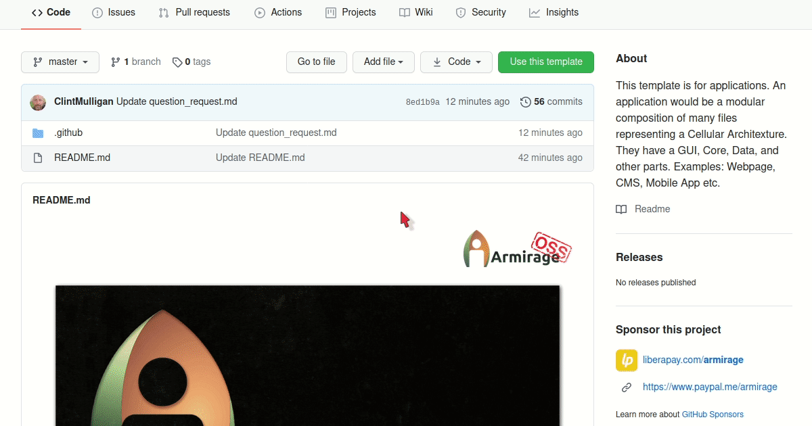

<!-- armirage .github SUPPORT.md -->
[:earth_americas: :speech_balloon: English](./l10n/support/index.md)\
[Table of Contents](#table-of-contents)

<!-- Armirage OSS Header -->

	

<!-- Banner -->

	
	

		<small>"Toolbox with tools on laptop" by maxxyustas, licensed under 123RF Standard</small>
		
			<a href="#banner-note">[1]</a>
		
	

&nbsp;
<!-- Content -->
<h1>Support Resources</h1>

<!-- Excerpt -->
> We understand how frustrating it can be when things break. Like most Open Source Software projects, Armirage OSS is maintained and supported by volunteers. Many of which donate their time and effort merely for the fun and passion of the technology. They balance this with prior obligations of health, family, and work. We appreciate your patience and cooperation in trying to resolve your issue. Following the steps outlined below will help us help you. Potentially resolve your issue quicker.

<!-- omit in toc -->
## Table of Contents
- [Getting Support](#getting-support)
	- [Review Documentation](#review-documentation)
	- [Search Previous Issues](#search-previous-issues)
	- [Create an Issue](#create-an-issue)
- [How to Contribute](#how-to-contribute)
- [Acknowledgements](#acknowledgements)
- [Contact](#contact)
- [Footnotes](#footnotes)

## Getting Support

### Review Documentation

Solutions or case specific instructions may be documented already.

- [ ] Review the repositories README.md for anything you may have missed.
- [ ] Check if the author has started a wiki for more detailed information.
- [ ] Check if the software generates additional documentation (such as JSDocs or Docco).

### Search Previous Issues

A solution may be reported in the `Issues` forum.

- [ ] Click on `Issues` within a repository's top menu.
- [ ] Search previous issues for keywords or terms related to your own.

### Create an Issue

With `Issues` we can collect end agent feedback, report software bugs, and organize tasks we want to accomplish. The `Issues` forum is more than just a place to report software bugs. A great place to ask questions as well.

> This project has a [Code of Conduct](./CODE_OF_CONDUCT.md). By interacting with this repository, organization, or community you agree to abide by its terms.

- [ ] Click on `Issues` within a repository's top menu.
- [ ] Click on `New issue`. 
- [ ] Find the most appropriate template. "Report a bug" or "Request for information". Click on `Get started`
- [ ] Add a Title. Try to make this as short yet descriptive as possible.
- [ ] Fill out the template. Use the comment lines (`<!-- Explanations... -->`) to assist.
- [ ] Click `Submit new issue`

The template will automatically label your submission with the proper "Type" and notify maintainers of your submission.

Congratulations! Now everyone will be able to assist you.

## How to Contribute

Review the [Contributing Guidelines](https://github.com/armirage/.github/blob/master/CONTRIBUTING.md) for ways to make this repository better.

Open Source Software (OSS) is only as strong as our Community.

## Acknowledgements

Peek[2](#peek-note) is an animated GIF screen recorder. It is intuitive and simple for creating screen recordings for READMEs.

## Contact

Armirage Github repositories and @armirage scoped NPM modules are maintained by [Armirage](https://www.armirage.com), A Technology Solutions company, feel free to <a href="mailto:helloyall@armirage.com">contact us</a>!

## Footnotes

<b id="banner-note">[1]:</b> ["Toolbox with tools on laptop"](https://previews.123rf.com/images/maxxyustas/maxxyustas1401/maxxyustas140100049/25276200-toolbox-with-tools-on-laptop.jpg) by [maxxyustas](https://www.123rf.com/profile_maxxyustas), licensed under [123RF Standard](https://www.123rf.com/license.php?type=standard) [:arrow_heading_up:](#anchor-1)

<b id="peek-note">[2]:</b> Peek - an animated GIF recorder <https://github.com/phw/peek> [accessed 28 September 2020] [:arrow_heading_up:](#anchor-2)

&nbsp;

&nbsp;

  
Armirage logos Copyright © 2020, Clinton Mulligan. All rights reserved.

